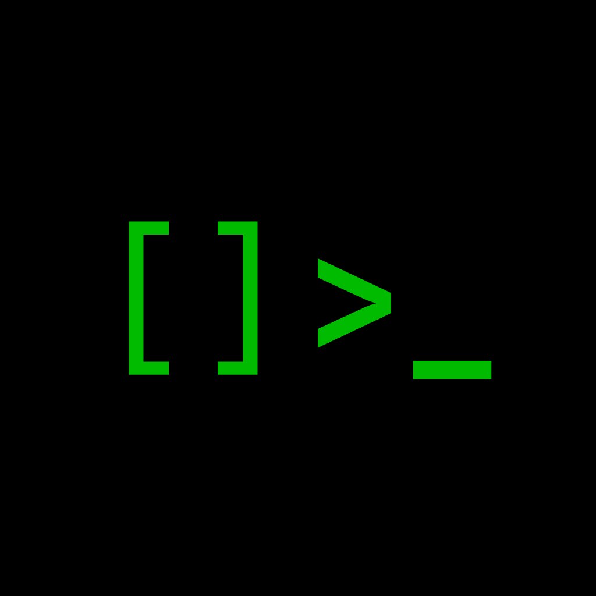
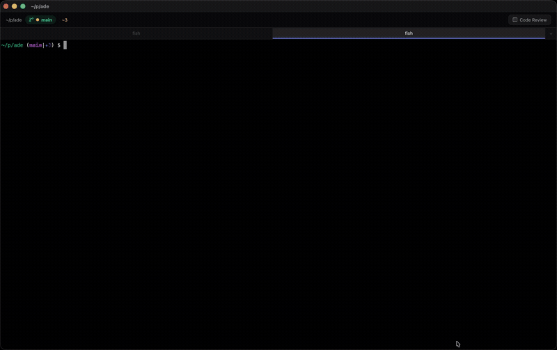
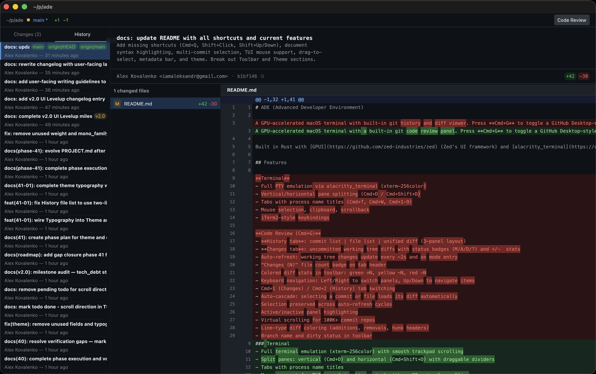
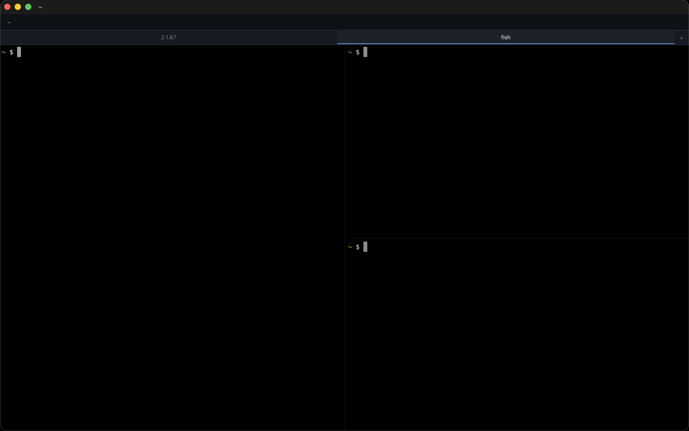

<p align="center">
  
</p>

<h1 align="center">Advanced Developer Environment (ADE)</h1>

<p align="center">
  <strong>Your terminal. Your diffs. One window.</strong>
</p>

<p align="center">
  ADE is a GPU-accelerated macOS terminal with a built-in code review panel.<br>
  Hit <kbd>Cmd</kbd>+<kbd>G</kbd> to open a 3-panel view of commit history, changed files,<br>
  and syntax-highlighted diffs — without ever leaving your terminal.
</p>

<p align="center">
  <a href="https://github.com/alexsds/ade/releases/latest/download/Ade.dmg">
    
  </a>
</p>

<p align="center">
  <a href="LICENSE"></a>
  
  
</p>

<br>

<p align="center">
  
</p>

<br>

## Why ADE?

Reviewing code means context switching: a terminal here, a git GUI there, `git log` and `git diff` in between. ADE eliminates that friction by embedding a full code review panel directly inside your terminal, one keystroke away.

- **Stay in flow.** Diffs and terminal output share the same window. No app switching, no lost context.
- **Zero configuration.** ADE detects your repository automatically. No dotfiles, no plugins, no setup wizard.
- **Full-featured terminal.** Powered by alacritty_terminal with split panes, tabs, and mouse support. ADE replaces your terminal entirely — it does not just sit alongside it.

## Features

### Code Review — <kbd>Cmd</kbd>+<kbd>G</kbd>

<p align="center">
  
  <br>
  <em>3-panel layout: commit history, file list, and syntax-highlighted unified diff</em>
</p>

| | |
|---|---|
| **History tab** | Browse commits, select files, and read syntax-highlighted unified diffs across a full 3-panel layout |
| **Changes tab** | View uncommitted working tree diffs with staged/unstaged indicators and status badges (M/A/D/?) |
| **Multi-commit select** | Shift+Click or Shift+Arrow to select a range of commits and view their combined diff |
| **Syntax highlighting** | 16 languages supported: Rust, JS/TS, Python, Go, C/C++, Java, Ruby, Shell, HTML, CSS, JSON, YAML, Markdown |
| **Word-level diffs** | Inline highlights pinpoint exactly what changed within each modified line |
| **Virtual scrolling** | Navigates repositories with 100K+ commits without lag |
| **Auto-refresh** | Working tree changes appear within ~2s; your selections persist across refreshes |

### Terminal

<p align="center">
  
  <br>
  <em>Split panes and tabs with GPU-accelerated rendering</em>
</p>

| | |
|---|---|
| **Full emulation** | xterm-256color via alacritty_terminal — your shell, your tools, your escape sequences, all working as expected |
| **Split panes** | Vertical (<kbd>Cmd</kbd>+<kbd>D</kbd>) and horizontal (<kbd>Cmd</kbd>+<kbd>Shift</kbd>+<kbd>D</kbd>) splits with draggable dividers |
| **Tabs** | Open, close, and switch between tabs with automatic process name titles |
| **Mouse support** | Click, drag, and scroll inside TUI apps (vim, htop, etc.) with native macOS natural scrolling |
| **Selection** | Double-click for words, triple-click for lines, drag to select, and full clipboard integration |
| **GPU-accelerated** | Rendered by GPUI (Zed's framework) for smooth scrolling and tear-free output |

### Toolbar

- Fish-style shortened current directory path
- Branch name with dirty/clean indicator
- Colored diff stats (green +N, yellow ~N, red -N) visible in all modes

### Theme

"Midnight Workshop" — a dark theme built on blue-tinted backgrounds with deep blue accents, layered depth, and hover feedback throughout.

## Install

### Download

Pre-built `.dmg` available on the [Releases](https://github.com/alexsds/ade/releases) page.

<!-- ### Homebrew
```bash
brew install --cask ade
``` -->

### Build from source

```bash
git clone https://github.com/alexsds/ade.git
cd ade
cargo build --release
./target/release/ade
```

#### macOS app bundle

```bash
cargo build --release
./scripts/bundle-macos.sh        # creates Ade.app
./scripts/create-dmg.sh          # creates Ade.dmg (drag-to-install)
```

### Requirements

- macOS (Apple Silicon or Intel)
- Rust toolchain (edition 2024) — only needed when building from source

## Keyboard Shortcuts

<details>
<summary><strong>General</strong></summary>

| Shortcut | Action |
|----------|--------|
| <kbd>Cmd</kbd>+<kbd>C</kbd> | Copy selection (or send SIGINT if no selection) |
| <kbd>Cmd</kbd>+<kbd>V</kbd> | Paste from clipboard |
| <kbd>Cmd</kbd>+<kbd>A</kbd> | Select all |
| <kbd>Cmd</kbd>+<kbd>Q</kbd> | Quit |

</details>

<details>
<summary><strong>Code Review</strong></summary>

| Shortcut | Action |
|----------|--------|
| <kbd>Cmd</kbd>+<kbd>G</kbd> | Toggle code review panel on/off |
| <kbd>Cmd</kbd>+<kbd>1</kbd> | Switch to Changes tab |
| <kbd>Cmd</kbd>+<kbd>2</kbd> | Switch to History tab |
| <kbd>Left</kbd> / <kbd>Right</kbd> | Cycle active panel (commits → files → diff) |
| <kbd>Up</kbd> / <kbd>Down</kbd> | Move selection in list panels; scroll diff line-by-line |
| <kbd>Shift</kbd>+<kbd>Click</kbd> | Select a range of commits |
| <kbd>Shift</kbd>+<kbd>Up</kbd>/<kbd>Down</kbd> | Extend commit selection |

</details>

<details>
<summary><strong>Panes</strong></summary>

| Shortcut | Action |
|----------|--------|
| <kbd>Cmd</kbd>+<kbd>D</kbd> | Split vertically (side-by-side) |
| <kbd>Cmd</kbd>+<kbd>Shift</kbd>+<kbd>D</kbd> | Split horizontally (top/bottom) |
| <kbd>Cmd</kbd>+<kbd>]</kbd> | Focus next pane |
| <kbd>Cmd</kbd>+<kbd>[</kbd> | Focus previous pane |
| <kbd>Cmd</kbd>+<kbd>W</kbd> | Close active pane |

</details>

<details>
<summary><strong>Tabs</strong></summary>

| Shortcut | Action |
|----------|--------|
| <kbd>Cmd</kbd>+<kbd>T</kbd> | New tab |
| <kbd>Cmd</kbd>+<kbd>Shift</kbd>+<kbd>W</kbd> | Close tab |
| <kbd>Cmd</kbd>+<kbd>}</kbd> | Next tab |
| <kbd>Cmd</kbd>+<kbd>{</kbd> | Previous tab |
| <kbd>Cmd</kbd>+<kbd>1</kbd>–<kbd>9</kbd> | Switch to tab N (terminal mode) |

</details>

## Roadmap

- [x] Full terminal emulation (alacritty_terminal)
- [x] GPU-accelerated rendering (GPUI)
- [x] Split panes and tabs
- [x] Git commit history browser
- [x] Unified diff viewer with syntax highlighting
- [x] Working tree changes panel
- [x] Multi-commit selection with combined diffs
- [x] Word-level diff highlighting
- [x] Mouse support for TUI apps
- [x] macOS app bundle and DMG installer
- [ ] Homebrew formula
- [ ] Configurable themes

## Tech Stack

- **[GPUI](https://github.com/zed-industries/zed)** — GPU-accelerated UI framework (from Zed)
- **[alacritty_terminal](https://crates.io/crates/alacritty_terminal)** — terminal emulation and PTY I/O
- **[git2](https://crates.io/crates/git2)** — libgit2 bindings for commit log, diff, and branch status
- **[tree-sitter](https://tree-sitter.github.io/)** — syntax highlighting for 16 languages

## Contributing

Contributions are welcome. See [CONTRIBUTING.md](CONTRIBUTING.md) for guidelines.

If you find a bug or have a feature request, please [open an issue](https://github.com/alexsds/ade/issues).

## License

[MIT](LICENSE)
